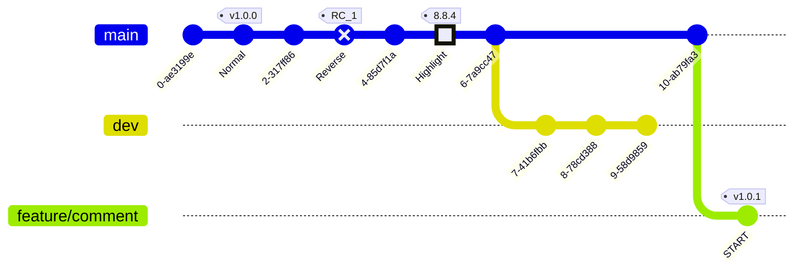

# Heading 1

## Heading 2-1

### Heading 3

## Heading 2-2

## Heading 2-3

# Heading 2

```js
function foo() {
  return 'bar'
}
const barz = {}

const fredo = () => {
  const obj = {
    x: 1,
    y: function () {
      return 2
    },
    c: null,
  }
  return obj
}

function closer(value : string) {
  let data = value
  return function () {
    return data
  }
}

interface IFoo {
  x: number
  y: string
}

function Gen<T extends Object, U extends unknown> {
  return function (obj: T, value: U) {
    return obj
  }
}

```

# CodePen Test

코드펜 접기 타이틀임 !codepen[https://codepen.io/shcrlk12/embed/PNaGbb]

!codepen[https://codepen.io/shcrlk12/embed/YzrRgPJ] 코드펜 타이틀

# Mermaid Test



